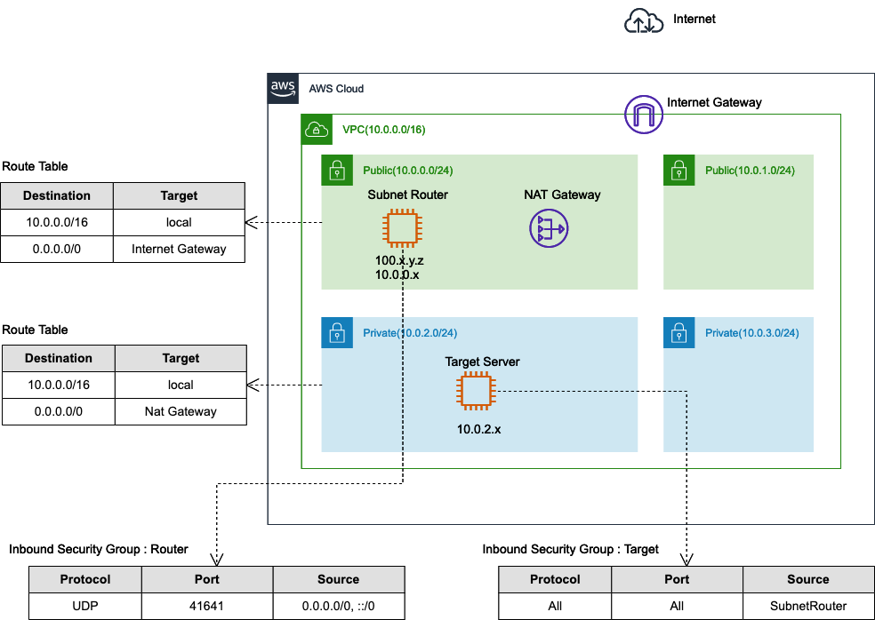

# tailscale-aws-vpc-subnet-route-cfn
AWS CloudFormation template for [Tailscale](https://tailscale.com/) VPC Subnet Router Demo.

# About

This is an AWS CloudFormation template to deploy Tailscale subnet router architecture for AWS VPC.

With this architecture, you can access any resources behind the router.



This template is based on the following template

https://github.com/awslabs/aws-cloudformation-templates/blob/master/aws/services/VPC/VPC_With_Managed_NAT_And_Private_Subnet.yaml
## AWS Resources created

- VPC(10.0.0.0/16)
- NAT Gateway
- 2 AZ * 2 Subnets(public, private)
- EC2(Amazon Linux 2)
  - subnet router(Tailscale client installed)
  - behind router

## How to deploy subnet router demo

Upload [the template](cfn/VPC_With_Managed_NAT_And_Private_Subnet.yaml) when you create a new Stack.

Be warned that you have to specify the EC2 key pair for SSH.

## How to play with subnet router demo

For the subnet router EC2, Tailscale is installed and IP forwarding enabled, but you have to make it join the Tailscale network.

To spin up a subnet router, run the following command.

```
$ sudo tailscale up \
  --advertise-routes=10.0.0.0/16 \
  --hostname=vpc-subnet-router


To authenticate, visit:

        https://login.tailscale.com/a/abcde

```

This command advertises subnet `10.0.0.0/16`(=VPC CIDR) to the Tailscale network.

## SSH to subnet router node

You can confirm the IP address assigned by Tailscale:

```
Subnet-Router-Node $ tailscale ip -4
100.91.173.79
```

Use this IP to SSH.


```
$ ssh /path/to/private.pem ec2-user@100.91.173.79

```
### SSH to nodes behind subnet router

Now the fun part.

You can traceroute and SSH instances(`10.0.2.20`) behind the subnet route(`100.91.173.79`).

```
$ traceroute 10.0.2.20
traceroute to 10.0.2.20 (10.0.2.20), 64 hops max, 52 byte packets
 1  100.91.173.79 (100.91.173.79)  27.135 ms  17.935 ms  18.342 ms
 2  10.0.2.20 (10.0.2.20)  19.396 ms  18.852 ms  18.364 ms

$ ssh /path/to/private.pem ec2-user@10.0.2.20
```

If RDS instances are created without public accessibility, the hostname is resolved with a private IP address outside the VPC.
This IP address belongs to the advertised routes.

You can access RDB instances from the Tailscale network in the same way.

```
$ dig +short database.xxx.eu-central-1.rds.amazonaws.com
10.0.3.176

$ mysqlsh --uri=admin@database.xxx.eu-central-1.rds.amazonaws.com:3306
...
 MySQL  database-1.c75dvgjlkohb.eu-central-1.rds.amazonaws.com:3306 ssl  JS >
```

## Resources

- [Subnet routers and traffic relay nodes · Tailscale](https://tailscale.com/kb/1019/subnets/)
- [Connect to an AWS VPC using subnet routes · Tailscale](https://tailscale.com/kb/1021/install-aws/)
- [Access AWS RDS privately using Tailscale · Tailscale](https://tailscale.com/kb/1141/aws-rds/)

